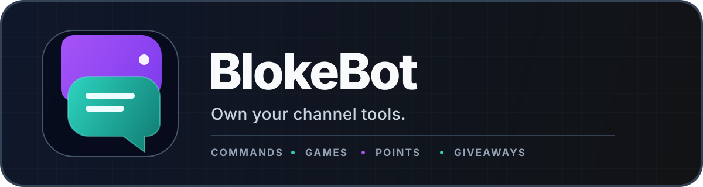

<div align="center">



[](https://github.com/alsi-lawr/BlokeBot/wiki)
[](https://github.com/alsi-lawr/BlokeBot/wiki/User-Guide)
[](https://github.com/alsi-lawr/BlokeBot/wiki/Installation)
[](https://github.com/alsi-lawr/BlokeBot/wiki/Install-with-Nix)

**A self-hosted Twitch bot and dashboard for running channel tools on your own terms.**

[User guide](https://github.com/alsi-lawr/BlokeBot/wiki/User-Guide) |
[Channel tools](https://github.com/alsi-lawr/BlokeBot/wiki/Channel-Tools) |
[Server setup](https://github.com/alsi-lawr/BlokeBot/wiki/Server-Owner-Guide)

</div>

## Inside BlokeBot

- **One dashboard** - switch between the Twitch channels you help manage.
- **Commands** - create replies, aliases, counters, cooldowns, and announcements.
- **Guessing games** - run rounds, reward winners, and share leaderboards.
- **Points and giveaways** - manage balances, gambling, prizes, and public rankings.
- **Clear status** - see whether the bot is ready and what needs your attention.
- **Your own copy** - keep channel data and credentials under your control.

## New to BlokeBot?

If someone has already set up BlokeBot for your channel, you do not need Docker or Nix.

1. Open the BlokeBot address they gave you.
2. Sign in with Twitch.
3. Choose your channel.
4. Follow the dashboard prompts to connect the bot and turn on the tools you want.

The **[User guide](https://github.com/alsi-lawr/BlokeBot/wiki/User-Guide)** walks through each step in plain language.

## Run your own copy

### Docker

```console
docker build --file packaging/docker/blokebot.Dockerfile --tag blokebot .
docker run --rm --init --publish 8080:8080 --volume blokebot-data:/data blokebot
```

### Nix

```console
nix run github:alsi-lawr/BlokeBot#blokebot -- serve
```

Open the dashboard, then follow the [server owner guide](https://github.com/alsi-lawr/BlokeBot/wiki/Server-Owner-Guide)
to finish setup.

For everyday help, start with the **[BlokeBot User Guide](https://github.com/alsi-lawr/BlokeBot/wiki/User-Guide)**.
